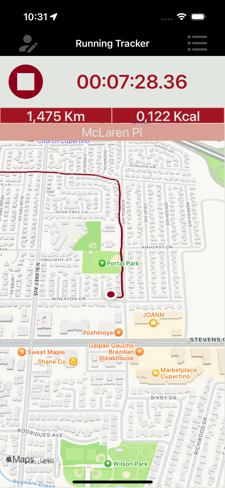
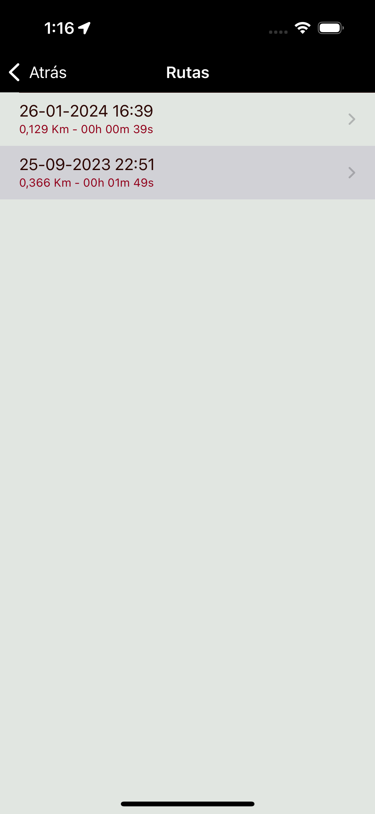

# Running Tracker

Running Tracker is a simple iPhone app to track your running workouts. It allows you to view your route on a map in real time, see the steps and distance traveled, check the number of calories burned and save each training session into an embedded database.

## Screenshots

 

 
